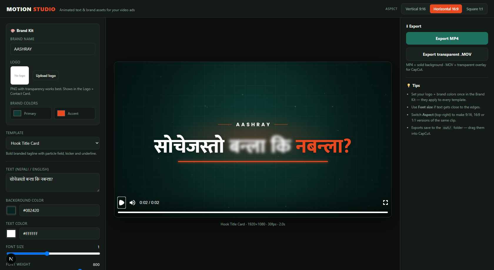
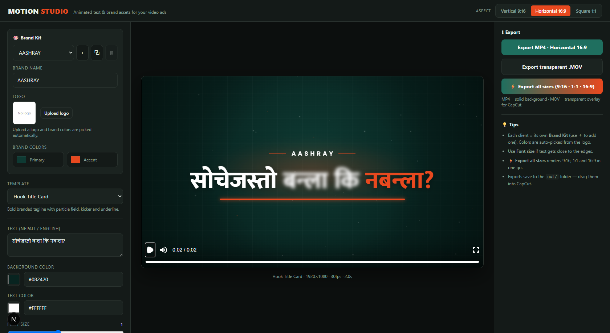
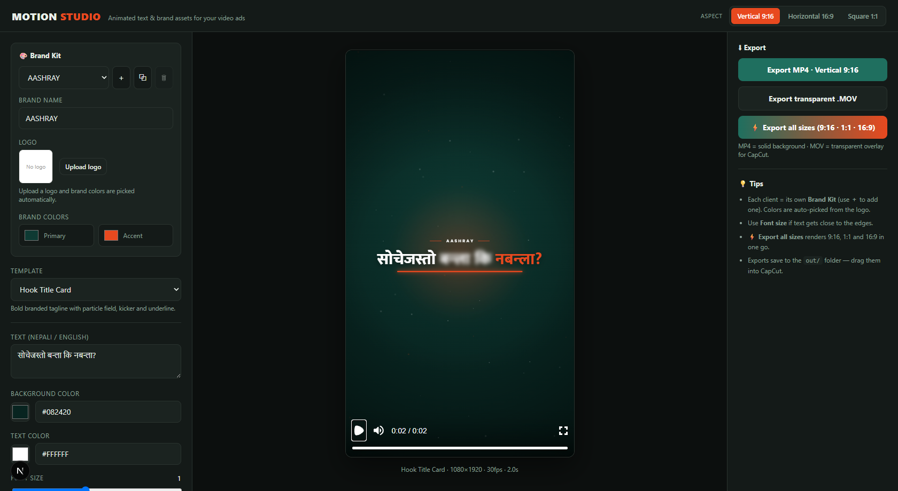
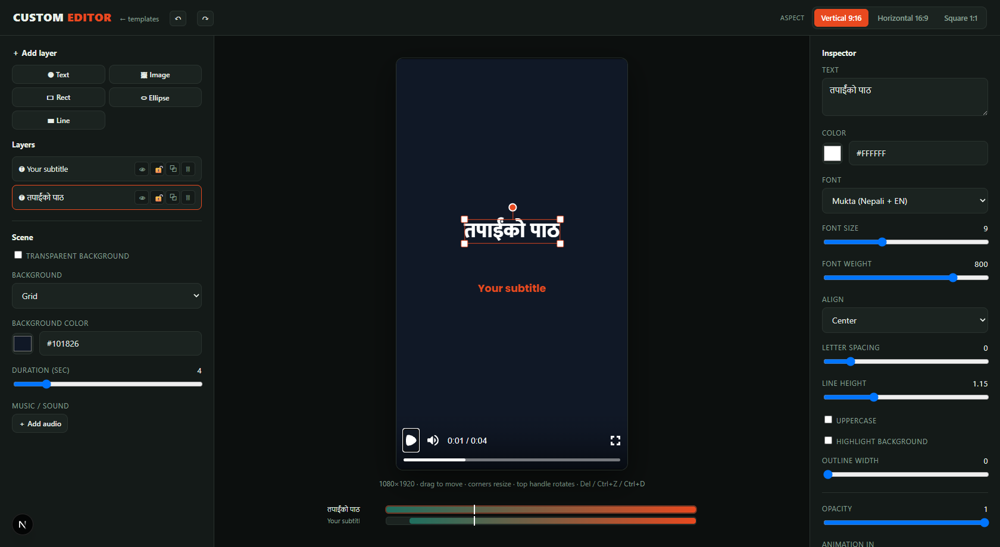

# 🎬 Motion Studio

> A tiny, local tool for making **animated text & brand assets** for video ads — in Nepali, English, or both.

Pick a template, type your text, set your brand colors and logo, preview it live, and
export a ready-to-use clip — with a solid background or a **transparent overlay** for
editors like CapCut. Runs entirely on your machine; rendering is **free** (no cloud).

Built with **[Remotion](https://www.remotion.dev/)** + **[Next.js](https://nextjs.org/)**.



---

## ✨ Features

- 🎨 **Brand Kit** — upload a logo and **brand colors are auto-picked from it**; set brand name once and it applies to every template.
- 👥 **Multiple brand kits** — save a separate kit per client and switch between them instantly.
- ✍️ **Bilingual text** — Devanagari (Nepali) renders correctly via **Mukta**; Latin via **Poppins**. Mixed Nepali + English lines just work.
- 🧩 **7 templates** — Hook Title · Logo + Contact Card · Text Animation (7 styles) · UGC Captions · CTA/Offer Card · Lower Third · Review/Stars Card.
- ✏️ **Custom editor** — free-form, layer-based designs: text + image layers, drag to position, **10 animations**, rotation, a per-layer **timeline** (start/end), and **background music**.
- 📐 **Aspect ratios** — Vertical 9:16, Horizontal 16:9, Square 1:1 — responsive layouts that **auto-fit** the text.
- ⚡ **Batch export** — render all three aspect ratios (9:16 · 1:1 · 16:9) in one click.
- 🔤 **Per-template controls** — background color, text color, font size, font weight, duration.
- 👁️ **Live preview** — instant playback via the Remotion Player, fit to your screen.
- ⬇️ **Instant download** — exports save straight to your browser's Downloads folder: **MP4** (solid bg), transparent **.MOV** (ProRes, for CapCut) or transparent **.WebM** (plays anywhere).

---

## 📸 Screenshots

**Logo + Contact Card** — animated logo build with contact rows (great as an intro/outro):



**Text Animation** in vertical 9:16, with the live preview fit to the viewport:



---

## 🚀 Getting started

```bash
npm install
npm run studio
```

Open **http://localhost:3333** in your browser.

> 💡 The first export bundles the project (~20s); every export after that is fast.

---

## 🧑‍🎨 How to use

1. **Set up your Brand Kit (left panel)** — click **Upload logo** (PNG with transparency is best) and your brand colors are picked automatically (tweak them anytime). Use ＋ to add a separate kit for each client and switch between them from the dropdown. Everything is remembered next time.
2. **Pick a template** from the dropdown.
3. **Choose an aspect ratio** (top-right): Vertical 9:16, Horizontal 16:9, or Square 1:1.
4. **Fill in the fields** — your text (Nepali / English / mixed), colors, **font size**, font weight, and duration. The preview updates instantly.
5. **Export (right panel):**
   - **Export MP4** → solid background — perfect as an intro/outro or full title card.
   - **Transparent .MOV** → see-through overlay for CapCut/Premiere (ProRes 4444).
   - **Transparent .WebM** → see-through overlay that also plays in browsers/VLC.
6. The file **downloads straight to your browser's Downloads folder**. Drag it onto your CapCut timeline. Done. ✅

> ℹ️ **Transparent file won't preview in Windows' default player?** That's expected — Windows Media Player can't decode ProRes/alpha video. Use the **.WebM** export (plays in Chrome/VLC) to check it, or just drop the `.MOV` straight into CapCut where it works fine.

---

## 🧩 Templates

| Template | What it is |
|---|---|
| **Hook Title Card** | Bold branded tagline with particle field, brand kicker and underline. Great opener/hook. |
| **Logo + Contact Card** | Animated logo build + contact rows (location / email / phone). Intro or outro. |
| **Text Animation** | Generic engine with 7 styles: Kinetic Scale, Word Pop, Fade + Slide Up, Letter Cascade, Typewriter, Glitch, Neon Glow. |
| **UGC Captions** | Word-by-word captions in 4 styles: Highlight · Box (Hormozi) · **Dynamic AI** (varying sizes/emphasis) · Karaoke. |
| **CTA / Offer Card** | Big offer headline + subtitle + call-to-action button + starburst. |
| **Lower Third** | Transparent name/role tag that slides in near the bottom. |
| **Review / Stars Card** | Animated star rating with a customer quote and name. |

### ✏️ Custom Editor

Open **Custom Editor** (top-right) to build your own layout from scratch — add text and
image/logo layers, **drag them to position**, and set each layer's color, font, size,
animation and timing. Save it and export like any other clip.



---

## 🛠 Project structure

| Path | What |
|---|---|
| `app/StudioApp.tsx` | The studio UI + live preview |
| `app/api/render/route.ts` | Local render endpoint (MP4 / transparent MOV) |
| `src/studio/templateMeta.ts` | Template list + which controls each template shows |
| `src/BrandTitle.tsx`, `src/BrandCard.tsx`, `src/TextAnimation.tsx` | The animation templates |
| `src/fonts.ts` | Poppins (English) + Mukta (Nepali / Devanagari) |
| `out/` | Your exported videos (git-ignored) |

### Add your own template

1. Create a parameterized Remotion component in `src/`.
2. Register it in `src/Root.tsx`.
3. Add an entry (label, controls, default props) in `src/studio/templateMeta.ts`.
4. Map its `compositionId` → component in `src/studio/registry.tsx`.

It then appears in the studio automatically.

---

## 📦 Commands

| Command | What it does |
|---|---|
| `npm run studio` | Run the web studio at http://localhost:3333 |
| `npm run remotion` | Open Remotion Studio (developer view of the raw compositions) |
| `npm run studio:build` | Production build of the web app |

---

## 🗺 Roadmap

See [`docs/ROADMAP.md`](docs/ROADMAP.md) for the full plan. Highlights:

- Auto captions from a voiceover (Whisper)
- Logo background removal
- Sound / music baked into exports
- Custom editor v2 — resize/rotate handles, shapes, out-animations, timeline

---

## License

UNLICENSED — free to use and adapt.
